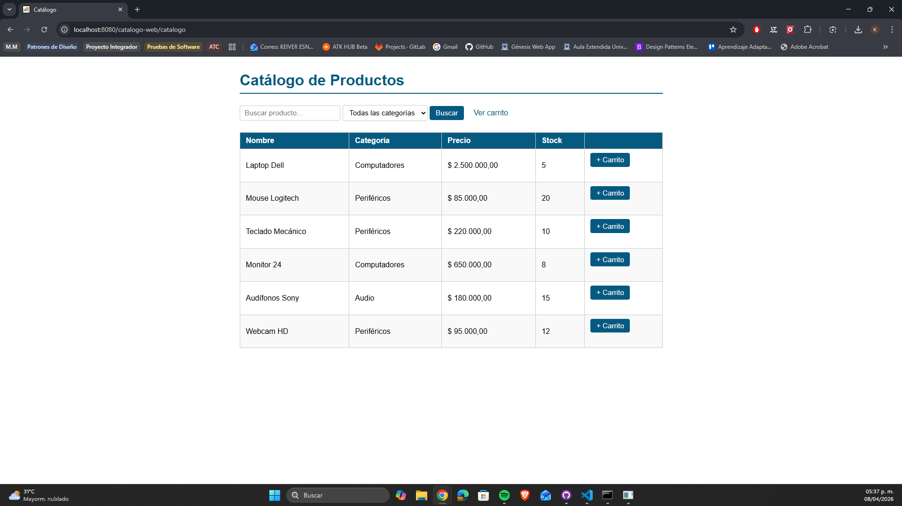
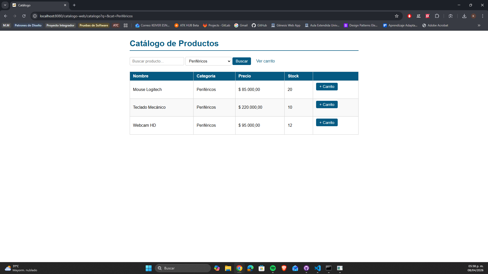
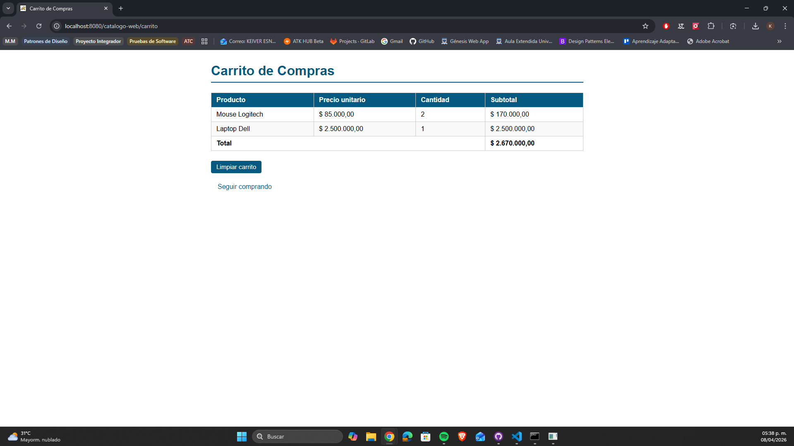
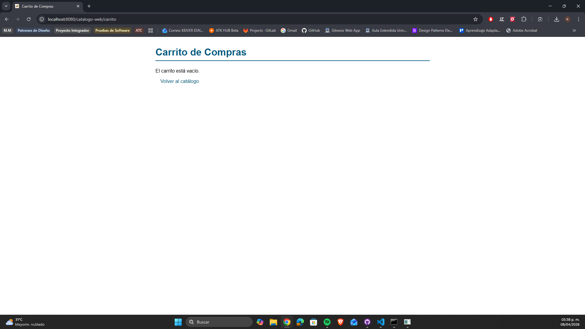

# Catálogo de Productos con Carrito — Post-Contenido 2 Unidad 5

> **Post-Contenido 2 — Unidad 5**

Aplicación web Java que implementa un catálogo de productos con búsqueda por nombre, filtrado por categoría y un carrito de compras almacenado en sesión HTTP. Cuenta con tres vistas: catálogo, carrito y confirmación de pedido.

## Tecnologías utilizadas

- **Java 21**
- **Jakarta Servlet API 6.0**
- **JSTL 3.0**
- **Apache Tomcat 10.1.52**
- **Maven 3.9.12**

## Estructura del proyecto

```text
src/
└── main/
    ├── java/
    │   └── com/ejemplo/
    │       ├── model/
    │       │   ├── Producto.java
    │       │   └── CarritoItem.java
    │       └── servlet/
    │           ├── CatalogoServlet.java
    │           └── CarritoServlet.java
    └── webapp/
        ├── WEB-INF/
        │   ├── views/
        │   │   ├── catalogo.jsp
        │   │   ├── carrito.jsp
        │   │   └── confirmacion.jsp
        │   └── web.xml
        ├── css/
        │   └── estilos.css
        └── index.jsp
```

## Requisitos previos

- **Java 17** o superior
- **Apache Tomcat 10.x**
- **Maven 3.8+**

## Instrucciones de ejecución

1. **Clonar el repositorio**

```bash
   git clone https://github.com/tu-usuario/castellanos-post2-u5.git
   cd castellanos-post2-u5
```

2. **Compilar el proyecto**

```bash
   mvn clean package
```

3. **Desplegar en Tomcat**

```cmd
   copy target\catalogo-web.war C:\tomcat10\webapps\
```

4. **Iniciar Tomcat**

```cmd
   C:\tomcat10\bin\startup.bat
```

5. **Acceder a la aplicación**

   [http://localhost:8080/catalogo-web/catalogo](http://localhost:8080/catalogo-web/catalogo)

## Funcionalidades

- **Catálogo:** muestra 6 productos con nombre, categoría, precio y stock
- **Búsqueda:** filtra productos por nombre en tiempo real (GET)
- **Filtro por categoría:** muestra solo productos de la categoría seleccionada
- **Carrito de compras:** almacenado en sesión HTTP, persiste entre peticiones
- **Agregar al carrito:** incrementa cantidad si el producto ya existe
- **Limpiar carrito:** vacía el carrito y redirige al catálogo
- **Patrón PRG:** redirige después de cada POST para evitar reenvío

## Capturas de pantalla

### Catálogo completo



### Filtrado por categoría



### Carrito con productos



### Carrito vacío


